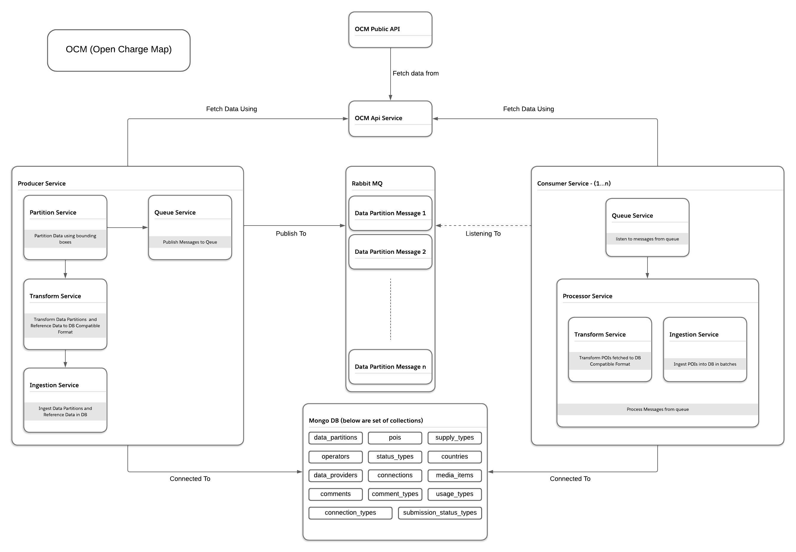
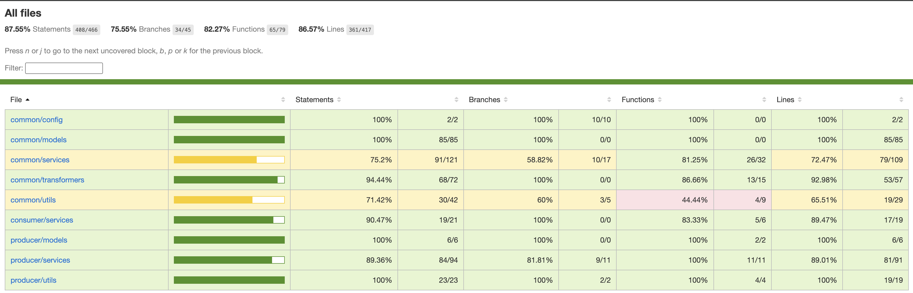

# OCM Data Import Service

## Service Goal

The service focuses on developing a scalable backend to process electric vehicle (EV) charging points data efficiently. Its primary goals are to enable seamless data ingestion, transformation, and storage. This service aims to enhance the organization’s ability to handle growing datasets, and support strategic decision-making in EV infrastructure management.

## Service High Level Architecture Overview



## Service Test Coverage



## Service Code Heirarchy

```
src/
├── __tests__/                   # E2E test cases for the service
├── common/                      # Shared functionality used across Producer and Consumer
│   ├── __tests__/               # Unit tests for common utilities and services
│   ├── config/                  # Configuration files and constants
│   ├── models/                  # Shared Mongoose models
│   ├── services/                # Shared services (e.g., RabbitMQ, OCM API)
│   ├── transformers/            # Data transformation utilities
│   ├── types/                   # Shared TypeScript interfaces and types
│   ├── utils/                   # Utility functions (e.g., helpers, error handlers)
├── consumer/                    # Consumer Service
│   ├── services/                # Consumer-specific business logic and services
│   ├── types/                   # Consumer-specific TypeScript interfaces and types
│   ├── index.ts                 # Entry point for the Consumer Service
├── mocks/                       # Mock data for testing
│   ├── poi.json                 # Mock POI data
│   ├── reference-data.json      # Mock reference data
├── producer/                    # Producer Service
│   ├── __tests__/               # Unit tests for Producer-specific services
│   ├── models/                  # Producer-specific Mongoose models
│   ├── services/                # Producer-specific business logic and services
│   ├── types/                   # Producer-specific TypeScript interfaces and types
│   ├── utils/                   # Utility functions specific to the Producer
│   ├── index.ts                 # Entry point for the Producer Service
```

## OCM API Documentation

https://openchargemap.org/site/develop/api#/

## GraphQL API Auth mechanisms (not implemented)

that depends on wether the api will be consumed through another microservice, in that case api-key authorization can
be introduced in service to service communication

in case the api will be consumed using a client, authentication and authorization can be introduced by json web tokens

## Database Structure

Database schemas are under `src/common/models` for all collections except data partition collection under `src/producer/models`

### Existing Relations

- POIs has direct relations with all reference data using the following fields (already existing in the ocm data)

```
  DataProviderID: number; // data provider for the poi
  OperatorID: number; // operator for the poi
  UsageTypeID: number; // usage type for the poi (payAtLocation, membership required, etc..)
  StatusTypeID: number; // is the poi operational or not yet
  SubmissionStatusTypeID: number; // is the poi live or not yet
```

### Introduced Relations (during import process)

- separating comments from inside poi data and put it in separate collection (add reference in comment document using PoiID)
- separating media items from inside poi data and put it in separate collection (add reference in media item document using PoiID)
- separating connections (equipments) from inside poi data and put it in separate collection (add reference in connection document using PoiID)

### Indices (what fields and why)

To optimize querying and filtering of POI data, the following indices are created on specific fields for each model. These indices improve database performance and ensure efficient data retrieval.

**1. AddressInfo**

- **Fields**:  
  `Town`, `StateOrProvince`, `CountryID`, `latitude`, `longitude`
- **Purpose**:  
  Enables filtering POI data based on commonly used location-based fields such as town, state, country, and geographic coordinates.

**2. ChargerType**

- **Fields**:  
  `IsFastChargeCapable`
- **Purpose**:  
  Allows filtering POI data by fast charging capability, which is a key requirement for users seeking high-speed charging stations.

**3. Comment**

- **Fields**:  
  `PoiID`
- **Purpose**:  
  Links user comments to a specific POI, enabling retrieval of reviews or feedback related to that POI.

**4. Connection**

- **Fields**:  
  `PoiID`
- **Purpose**:  
  Fetches connection details (e.g., charging specifications) related to a specific POI.

**5. MediaItem**

- **Fields**:  
  `PoiID`
- **Purpose**:  
  Associates media items (e.g., images, videos) with a specific POI, enhancing the data with visual or informational content.

**6. Country**

- **Fields**:  
  `ISOCode`
- **Purpose**:  
  Facilitates filtering of POI data by country ISO code, supporting country-specific queries.

**7. SubmissionStatus**

- **Fields**:  
  `IsLive`
- **Purpose**:  
  Enables retrieval of only live and active POIs, ensuring that the returned data is up-to-date.

**8. UsageType**

- **Fields**:  
  `IsPayAtLocation`, `IsMembershipRequired`, `IsAccessKeyRequired`
- **Purpose**:  
  Allows filtering of POIs based on usage types, such as whether payment, membership, or access keys are required.

## Local Development Guide

1. install pnpm if not installed on your computer here [pnpm](https://pnpm.io/)
2. `pnpm install` inside project directory
3. Make sure docker is running
4. add `.env` file using `.env.example` as a reference
5. run `docker-compose up --build -d` to build and run all services
6. check logs of all services by running `docker-compose logs -f` or specific service by running `docker-compose logs -f <service_name>`
7. you can run tests using `pnpm test`

## Deployment Instructions (AWS ECS Fargate)

1. Create ECS Cluster, ECS Services (Service for consumer can scale based on number of messages in the queue), ECR Repository, Proper IAM Roles using IAC tool like CLoudformation or Terraform.
2. Deploy the Cluster using aws cli configured with AWS Credentials.
3. Create Task Definition file for each service specifying container configurations under `.aws/task-definitions`.
4. Leverage aws cli commands in a `.github/workflows` github workflow to build images, push them to ECR Repos,
   register task definitions to pushed docker image, deploy the ecs services to AWS ECS Cluster
5. Make sure containers can talk to each other inside the cluster leveraging AWS VPC Components.
6. AWS SQS and Mongo Atlas can be used instead of rabbitMQ and mongodb docker containers.

## GraphQL Integration Support (Not Implemented Just Elaboration)

1. **Schema Definition**
   A GraphQL schema is defined to represent the structure of the imported POI data.
   Types for POI, AddressInfo, Connection, MediaItem, and other related reference data (e.g., ChargerTypes, StatusTypes) are created to reflect the relationships within the data.

2. **Data Fetching**
   The GraphQL resolvers are implemented to fetch the POI data from MongoDB. The data can be queried either partially or fully based on the client’s request.
   Resolvers utilize the existing Mongoose models for POI and its related entities (e.g., AddressInfo, Connections).
   Filters and arguments such as limit, country, or id allow clients to retrieve relevant data dynamically.

3. **Query Flexibility**
   Clients can fetch only the required fields to minimize payload size

4. **Integration with Existing Services**
   The GraphQL layer integrates seamlessly with the existing Ingestion Service and MongoDB.
   Cached results and efficient querying ensure high performance when serving data.

5. **Endpoint Exposure**
   The GraphQL server runs alongside the existing services (e.g., Producer, and Consumer) in the application.
   The endpoint is exposed as /graphql within the service infrastructure.

## Scalability

Scalability (horizontal scaling) can be acheived by increasing number of consumers which is responsible for data fetching/ingesting for specific data partition. To acheive that we need to partition data that OCM API has. Since OCM API doesn't support pagination, we could acheive that using a different technique.

In this service we used boundingbox param to divide the world map by bounding boxes with max threshold for data retrieved using a bounding box. A producer service will be responsible for this and pushing the data partitions to a queue, which in returns are consumed by any number of consumers for concurrent and reliable import process.

## Monitoring and Logging

To ensure effective monitoring and observability for the service, we can do the following:

1. **Logging**

- **Purpose**: Capture structured logs for troubleshooting and auditing.
- **Key Areas**:
  - **Partitioning**: Log the number of partitions created or updated.
  - **API Calls**: Log latency, request status, and any errors from the OCM API.
  - **Queue Operations**: Log messages sent to and consumed from RabbitMQ.
- **Logging Tools**:
  - **winston**: For reliable logging.

2. **Metrics**

- **Purpose**: Provide insights into system performance and behavior.
- **Custom Metrics**:
  - `active_partitions`: Number of active data partitions.
  - `ocm_api_latency_seconds`: Histogram to track OCM API latency.
  - `queue_message_depth`: Number of messages in RabbitMQ queues.
- **Monitoring Tools**:
  - **Prometheus**: For collecting and querying metrics.
  - **Grafana**: For creating dashboards and visualizing metrics.

3. **Error Tracking**

- **Purpose**: Real-time detection and alerting of system errors.
- **Error Tracking Tools**:
  - **Sentry**: For capturing exceptions and error reporting.
- **Critical Areas to Monitor**:
  - OCM API failures.
  - Queue connection errors.
  - Data ingestion failures.

4. **Health and Readiness Checks**

- **Purpose**: Ensure the service is healthy and ready to process requests.
- **Checks**:
  - **Database Connectivity**: Verify connection to MongoDB.
  - **Queue Connectivity**: Verify connection to RabbitMQ.
  - **API Service Status**: Ensure the OCM API is reachable and responsive.

5. **Monitoring Setup**

- **Prometheus and Grafana**:
  - **Prometheus**: Scrapes metrics exposed by the service on the `/metrics` endpoint.
  - **Grafana**: Visualizes metrics such as API latency, partition count, and queue depth through dashboards.

## How API calls are minimized and payloads are optimized?

API calls are minimized by experimenting how many results we can get in a single api call without our system crashing or exceeding
maximum payload size. We choose 50000 results (could be increased when monitoring memory and according to deployment instance CPU and RAM) as a good average without exceeding max payload size and not overloading service memory.

Payloads and network costs are optimized by using `compact=true` param which doesn't return expanded objects, where we fetch those
reference objects one time only in the producer service and saving only their reference IDs in POI data. By doing this we are decreasing the payload size and then can increase the max number of results we can get in single api call.

## Future Work and Improvements

- DB Transactions for related data writes
- Retries strategy
- Use data from all providers with open data license
- Dead letter queue and error handling
- Add username/password to mongo
- Better error tracing and performance metrics (monitoring)
- GraphQL integration support
