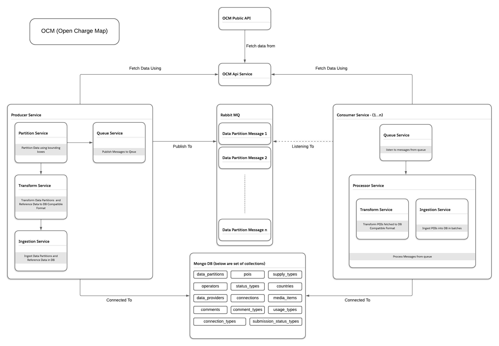

# OCM Data Import Service

## Service Goal

The service focuses on developing a scalable backend to process electric vehicle (EV) charging points data efficiently. Its primary goals are to enable seamless data ingestion, transformation, and storage. This service aims to enhance the organization’s ability to handle growing datasets, and support strategic decision-making in EV infrastructure management.

## Service High Level Architecture Overview



## Service Code Heirarchy

```
src/
├── __tests__/                   # E2E test cases for the service
├── common/                      # Shared functionality used across Producer and Consumer
│   ├── __tests__/               # Unit tests for common utilities and services
│   ├── config/                  # Configuration files and constants
│   ├── models/                  # Shared Mongoose models
│   ├── services/                # Shared services (e.g., RabbitMQ, OCM API)
│   ├── transformers/            # Data transformation utilities
│   ├── types/                   # Shared TypeScript interfaces and types
│   ├── utils/                   # Utility functions (e.g., helpers, error handlers)
├── consumer/                    # Consumer Service
│   ├── services/                # Consumer-specific business logic and services
│   ├── types/                   # Consumer-specific TypeScript interfaces and types
│   ├── index.ts                 # Entry point for the Consumer Service
├── mocks/                       # Mock data for testing
│   ├── poi.json                 # Mock POI data
│   ├── reference-data.json      # Mock reference data
├── producer/                    # Producer Service
│   ├── __tests__/               # Unit tests for Producer-specific services
│   ├── models/                  # Producer-specific Mongoose models
│   ├── services/                # Producer-specific business logic and services
│   ├── types/                   # Producer-specific TypeScript interfaces and types
│   ├── utils/                   # Utility functions specific to the Producer
│   ├── index.ts                 # Entry point for the Producer Service
```

## API Documentation

## Database Structure

## Local Development Guide

## Deployment Instructions

## GrapghQL Integration Support

## Monitoring and Logging

## How API calls are minimized ?
